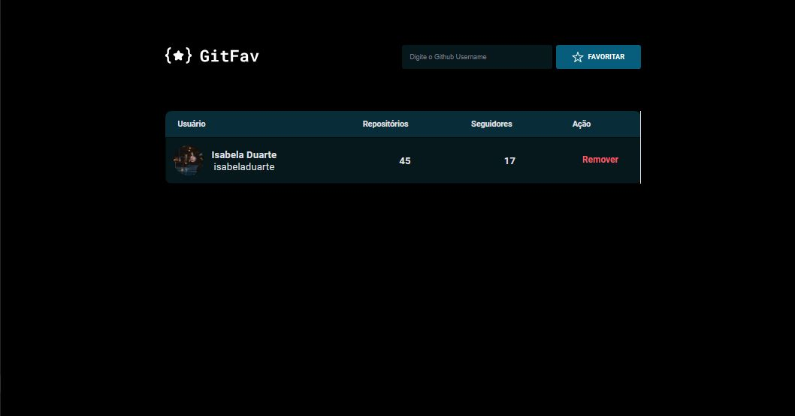

<h1 align="center">FocusTimer - Dark Mode</h1>

Esse projeto tem como objetivo de adicionar os perfis favoritos do Github. 

  <a href="#-tecnologias">Tecnologias</a>&nbsp;&nbsp;&nbsp;|&nbsp;&nbsp;&nbsp;
  <a href="#-layout">Layout</a>&nbsp;&nbsp;&nbsp;|&nbsp;&nbsp;&nbsp;
  <a href="#memo-licença">Licença</a>

  

  

## 🚀 Tecnologias

Esse projeto foi desenvolvido com as seguintes tecnologias:

- HTML, CSS e JS
- Git e Github
- Figma

## 🔖 Layout

Você pode visualizar o layout do projeto através [desse link](https://www.figma.com/file/yUQ0wGMJSj8Q75ClgfImyg/%5BDesafios-Explorer%5D-GitFav-(Copy)-(Copy)?type=design&node-id=205-951&mode=design&t=jTMwTqh9zJtB7yOf-0). É necessário ter conta no [Figma](https://figma.com) para acessá-lo.

## 📝 Licença

Esse projeto está sob a licença MIT.

---

Feito com ♥ by Isabela